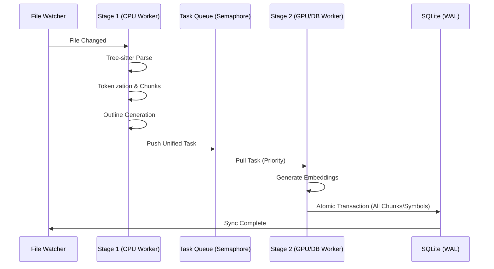
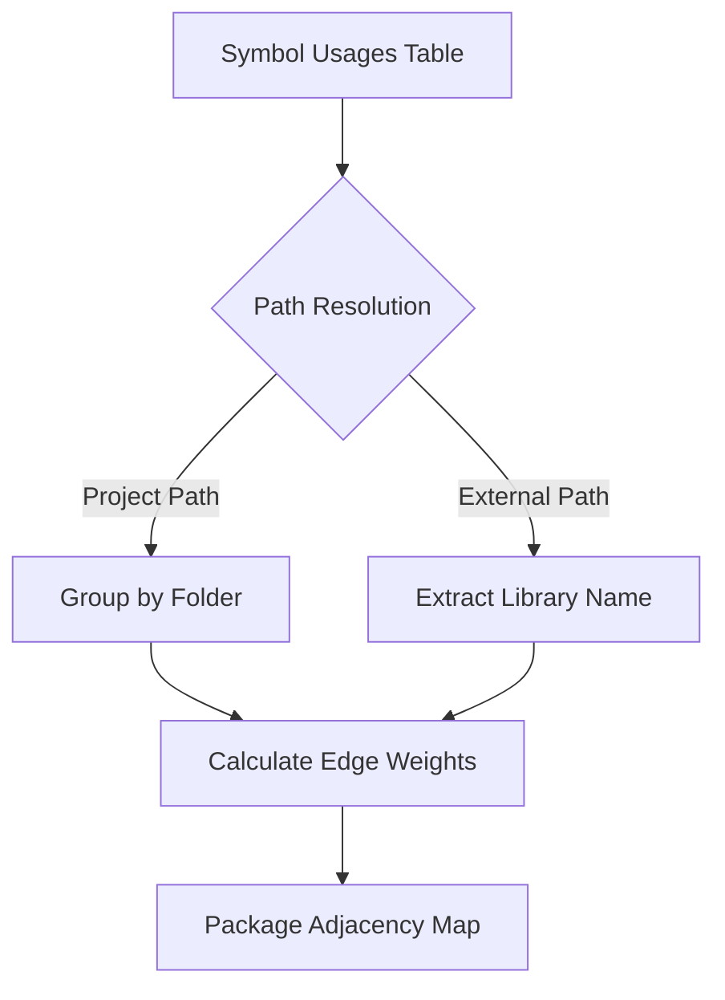

# CodeTextor Architecture

## Design Philosophy

CodeTextor is designed around core principles that guide all architectural decisions:

1. **Local-First**: Zero cloud dependencies, complete data sovereignty
2. **Multi-Project Isolation**: Complete separation between codebases with no cross-contamination
3. **Embedded Intelligence**: Self-contained RAG-like system without external services
4. **Standard Protocols**: MCP (Model Context Protocol) for universal IDE/AI integration
5. **Developer Transparency**: All data inspectable, no black boxes

---

## High-Level Architecture

### Three-Layer Design

```
┌─────────────────────────────────────────┐
│         Frontend Layer (Vue)             │  User interface for project
│    Project management, search, stats     │  management and visualization
└─────────────────┬───────────────────────┘
                  │ Wails Bindings
┌─────────────────┴───────────────────────┐
│         Backend Layer (Go)               │  Code analysis, embedding,
│   Parsing, chunking, indexing, MCP       │  storage, and retrieval
└─────────────────┬───────────────────────┘
                  │
┌─────────────────┴───────────────────────┐
│       Storage Layer (SQLite)             │  Configuration and per-project
│   Config DB + Per-Project Vector DBs     │  vector indexes
└─────────────────────────────────────────┘
```

**Why this architecture?**

- **Frontend/Backend Separation**: UI logic separate from analysis logic enables future headless mode
- **Go Backend**: Performance for parsing large codebases, native cross-platform support
- **SQLite Storage**: Embedded database eliminates setup complexity, enables offline-first operation
- **Wails Integration**: Single binary distribution, native performance with modern web UI

---

## Multi-Project Architecture

### Design Decision: Complete Isolation

**Problem:** How to support multiple codebases without data mixing?

**Solution:** One database per project, explicit project scoping in all APIs.

**Why not a single database with project_id filtering?**

- **Simpler Queries**: No need to filter every query by project_id
- **Easier Backup**: Copy single `.db` file to backup/restore a project
- **Independent Lifecycle**: Delete, archive, or migrate projects without affecting others
- **Performance**: Smaller indexes per project, faster queries
- **Security**: Impossible to accidentally leak data between projects

### Storage Strategy

```
Configuration & Storage Root:
  <AppDataDir>/              ← OS-specific (Linux: ~/.local/share/codetextor,
                                macOS: ~/Library/Application Support/codetextor,
                                Windows: %LOCALAPPDATA%\codetextor)
    config/projects.db       ← Global config (app_config table, embedding catalog, selected project)
    indexes/project-*.db     ← Per-project vector databases (one file per project)

 Per-Project Database Contents:
  tables: files, chunks, symbols, chunk_symbols, outline_nodes, outline_metadata, project_meta, symbol_usages, symbol_implementations
  data: embeddings, semantic chunks with metadata, AST symbols, outlines, project config snapshot, cross-references
```

**Implementation Details:**
- Each per-project database is created automatically on project creation.
- OS-Specific Roots:
  - Windows: `%LOCALAPPDATA%\codetextor`
  - Linux: `~/.local/share/codetextor`
  - macOS: `~/Library/Application Support/codetextor`
- Migrations for per-project DBs are embedded in `backend/internal/store/vector_migrations/`.
  - **Migration 000006**: Normalized schema with integer file IDs, foreign keys, and restructured outline storage.
  - **Migration 000010**: Added `symbol_implementations` table to track OOP relationships.
  - **Migration 000012**: Added `language` column to `symbols` table for precise multi-language tracking.
  - **Migration 000013**: Added `size_bytes` column to `files` table for persistent file size tracking.
- **Transactional Consistency**: All file-related data (chunks, symbols, outlines) is saved within a single SQLite transaction via `InsertFileTasksInTransaction` to prevent partial indexing or "dirty" states.
- **WAL Mode**: Project databases use Write-Ahead Logging to support concurrent read/write operations during heavy indexing.

**Benefits:**
- Projects are portable (copy `.db` + config entry)
- No risk of cross-contamination
- Each project can have different indexing parameters
- Simpler queries (no filtering by `project_id` needed)
- Simpler to reason about data boundaries

### Embedding Model Management

- **Global catalog**: The config database owns the list of embedding models (preloaded or user-defined). Each row stores the model id, label, vector dimension, size on disk, RAM/latency estimates, multilingual + code-quality capabilities, download/conversion source, download status, and final local path under `<AppDataDir>/models/<modelId>/` (same OS-specific root as above).
- **Indexing Management View**: A comprehensive control module for the project lifecycle. It integrates real-time progress monitoring (status, counters), index scope configuration (Include/Exclude relative paths), control settings (Continuous Indexing toggle), and an interactive file explorer to verify indexed content with search and filtering.
- **Per-project snapshot**: When a project selects a model, the entire metadata record (including download status and local path) is serialized inside `project_meta.config_json`. Moving the `.db` to another machine guarantees the new installation can recreate the catalog entry and (re)download the required files automatically.
- **Download orchestration**: The backend download helper streams the configured source URI (HTTP(S) or local path) into `<AppDataDir>/models/<id>/model.onnx` (or custom filenames), updating the catalog status (`pending`, `downloading`, `ready`, `missing`, `error`). Download progress events are emitted to the frontend so the UI can show a determinate modal; FastEmbed models fall back to Hugging Face mirrors when the public CDN fails. When a repository does not publish ONNX assets (e.g., `nomic-ai/nomic-embed-code`), the user can still add custom entries with manual SourceURI/Tokenizer paths.
- **Dual backend (FastEmbed + ONNX)**: Both FastEmbed and pure ONNX entries rely on the same ONNX Runtime shared library. Every model—FastEmbed included—is downloaded explicitly via the Indexing view before it becomes available. When the runtime is missing, both sets of models are disabled in the UI and the backend falls back to the mock embedding client.
- **ONNX runtime detection**: During startup, the backend attempts to initialize the `onnxruntime` shared library using the path stored in the config database. If successful, a single ONNX session per model ID is kept in memory.
- **Dynamic VRAM-aware Batching (Native ONNX)**: For models using the native DirectML/CoreML backend, the system no longer uses a static batch size. The batch size is dynamically calculated using the formula `2^round(log2(Available_VRAM_GB * 8.0))` to ensure optimal power-of-2 alignment on modern GPUs.
- **Embedding Task Priorities**: CodeTextor uses a priority-based queue in `models/priority.go` to ensure UI responsiveness:
  - **PriorityHigh (2)**: User-initiated actions (e.g., semantic search/manual reindex) for immediate results.
  - **PriorityNormal (1)**: Default for initial project indexing and startup sync.
  - **PriorityLow (0)**: Background file-watcher updates during active editing.


---

## Core Subsystems

### 1. Project Management

**Purpose:** Abstract multi-project support as a tenant system.

**Key Concepts:**
- Projects are configuration containers, not tied to single directory
- Each project defines its own include/exclude paths (can span multiple directories)
- Selection state and indexing state managed in database (not localStorage) for consistency
- Auto-selection fallback when current project deleted

**Why database-based state?**
- Single source of truth accessible from frontend and backend
- Survives project deletion (auto-selects next available)
- Transactional consistency (only one selected at a time)
- Persistent indexing state survives app restarts
- No desync between UI and backend state

### 2. Semantic Chunking Engine

**Purpose:** Transform raw code into semantically meaningful retrieval units.

**Design Principles:**
- **Tree-sitter Parsing**: Language-agnostic AST extraction with 10+ language support
- **Semantic Boundaries**: Chunks align with code structure (functions, classes, modules)
- **Context Enrichment**: Attach file/package info, merge comments, include metadata headers
- **Adaptive Sizing**: Split large chunks toward ~400 tokens (hard max 800), merge small ones (<100 tokens)

**Why not simple line-based chunking?**
- Semantic units preserve logical context
- Better embedding quality (complete thoughts vs arbitrary splits)
- Enables accurate code navigation (jump to function definition)

**Implementation Details:**

The semantic chunking system consists of three main components:

1. **Parsers** (`backend/internal/chunker/query_parser.go`, `parsers/default/*.toml`)
   - **QueryParser Engine**: A dynamic, configuration-driven motor that uses Tree-sitter queries defined in TOML files to extract symbols, imports, and metadata.
   - **Zero-Code Extensions**: Support for new languages is added by dropping a TOML file into the registry, requiring no backend recompilation.
   - **Supported languages**: Go, Python, TypeScript/JavaScript, HTML, CSS, Vue, Markdown, SQL, JSON, PHP (all driven by the dynamic engine except specialized structural parsers).
   - **Nested Code Parsing**: Automatically detects and parses embedded code (HTML/JS in PHP, SQL in Go/Python, etc.) using the `SubLanguageManager` and dynamic delegation.

2. **SubLanguageManager** (`backend/internal/chunker/sub_language.go`)
   - **Statistical Detection**: Uses `github.com/go-enry/go-enry/v2` (Markov-chain based) to identify the language of embedded snippets when the config uses the `"detect"` keyword. This provides a robust, data-driven approach to determine the language of code within a larger file (e.g., JavaScript inside an HTML script tag).
   - **Precision Parsing**: Leverages Tree-sitter's `SetIncludedRanges` API. This powerful feature allows a sub-parser to focus on a specific byte range within the parent file while still having access to the full file's context. This is crucial for maintaining absolute line/byte offsets for symbols and chunks, eliminating the need for manual recalculation and ensuring accurate mapping back to the original source.
   - **Fallback Heuristics**: Custom rules for common short fragments (HTML, SQL) where statistical detection might lack sufficient context. These heuristics provide a quick and reliable way to identify languages in cases where `go-enry` might not have enough data for a confident prediction.

3. **Enricher** (`backend/internal/chunker/enrichment.go`)
   - `CodeChunk`: Structure containing enriched content + raw source code
   - `ChunkEnricher`: Transforms symbols into enriched chunks
   - Enrichment includes:
     - File path and language headers
     - Symbol metadata (name, kind, parent, visibility, signature)
     - Package name and imports
     - Documentation/comments
   - Token estimation (~1 token per 4 characters)
   - Adaptive merge/split logic with enrichment overhead accounting

3. **Semantic Chunker** (`backend/internal/chunker/semantic_chunker.go`)
   - Public API for chunking: `ChunkFile(filePath, source) -> []CodeChunk`
   - Complete pipeline: Parse → Enrich → Merge → Split
   - Configurable via `ChunkConfig`:
     - `MaxChunkSize`: 800 tokens (default)
     - `MinChunkSize`: 100 tokens (default)
     - `MergeSmallChunks`: true (default)
     - `IncludeComments`: true (default)
   - Fallback to line-based chunking for unsupported file types

**Indexer Integration:**

The indexer (`backend/pkg/indexing/indexer.go`) uses semantic chunking with intelligent change detection:
- **Hash-based change detection**: Computes SHA-256 hash of file content using `utils.ComputeHash()`
- **Skip unchanged files**: Compares current hash + mtime with database records to avoid re-indexing
- Checks if file is supported via `semanticChunker.IsSupported()`
- Uses semantic chunks for supported files (enriched content for embedding)
- Falls back to simple line-based chunking for unsupported formats
- Configuration derived from project settings (`ChunkSizeMax`, `ChunkSizeMin`)
- **Incremental updates**: Deletes old chunks before re-indexing modified files
- **Concurrent processing**: Semaphore-limited goroutines (10 concurrent operations) for parallel file processing

### 3. Vector Indexing

**Purpose:** Enable semantic code search without external services.

**Design Decisions:**
- **SQLite-vec Extension**: Embedded vector search, no separate database
- **Per-Project Indexes**: Complete isolation between codebases
- **Incremental Updates**: Only re-index changed files (hash + mtime tracking)
- **Semantic search path**: The `Search` endpoint embeds the query, then performs cosine similarity over stored embeddings (currently brute-force within the project DB). Future work can swap this for sqlite-vec indexes.

**Why SQLite-vec vs dedicated vector DB?**
- Embedded: No separate server to manage
- Portable: Single `.db` file per project
- Proven: SQLite reliability + vector search capabilities
- Offline: Works without network access

### 4. MCP Server

**Purpose:** Expose code intelligence to external tools via standard protocol.

**Architecture Goals:**
- **Protocol-First**: MCP standard ensures compatibility with any MCP client
- **Project-Scoped**: Every API call requires explicit `projectId` parameter
- **Resource-Bounded**: Configurable limits prevent resource exhaustion
- **Path-Validated**: Enforce include path boundaries for security

**Why MCP vs custom API?**
- Standard protocol means broad IDE/tool support
- No vendor lock-in
- Community-driven protocol evolution

**Implementation (current):**
- Streamable HTTP transport using `modelcontextprotocol/go-sdk` with a shared server instance plus per-project bound servers resolved from `/mcp/<projectId>` URLs (calls without projectId are rejected)
- Persisted config (host, port, protocol, autostart, max connections) stored in the config DB; optional auto-start on app launch
- Status + tools telemetry emitted every 2s (`mcp:status`, `mcp:tools`) so the Vue MCP view can display uptime, active connections, total requests, and enablement
- Tools: `getProjectDetails` (config & stats), `listFiles` (file tree), `semanticSearchFiles` (relevant files by concept), `search` (semantic chunk retrieval), `outline` (symbol tree), `nodeSource` (robust source snippets with fuzzy matching), `getRecentChanges` (recent mods), `grepSearch` (tabular literal/regex search), `findReferences` (usage tracking), `findImplementations` (OOP polymorphism discovery), `getCallGraph` (call hierarchy), `findTodos` (structured marker discovery), and `getPackageGraph` (architectural dependency map).

---

## Data Flow Examples

### Multi-Stage Indexing Pipeline

CodeTextor uses a decoupled, asynchronous pipeline to maximize throughput and maintain UI responsiveness.



**Key Architectural Decisions:**
- **Asynchronous Decoupling**: CPU tasks (parsing) and GPU tasks (embedding) run in separate worker pools.
- **Priority Queue**: User-initiated searches pre-empt background indexing tasks.
- **Semantic Symbol IDs**: Instead of random hashes, symbols use deterministic IDs (`path|Lstart-end|name`). This allows external agents to reference code locations consistently without recalculating hashes.
- **Fuzzy Resolution Fallback**: To improve resilience against imprecise AI queries, `nodeSource` includes a fuzzy resolver that parses ID components and searches for symbol/line intersections when an exact lookup fails.
- **Normalization**: All database keys are strictly normalized to prevent duplicate discovery during indexing.

### Retrieval Flow

```
MCP client sends query + projectId
    ↓
Validate projectId exists
    ↓
Embed query → vector
    ↓
Search project's vector DB (top-k similarity)
    ↓
Apply path boundary filters
    ↓
Return chunks with metadata
```

**Key Decisions:**
- Explicit projectId prevents accidental cross-project queries
- Path validation ensures results stay within configured scope
- Byte caps prevent unbounded responses

---

## Frontend Component Architecture

**Purpose:** Provide modular, maintainable UI components following Vue 3 best practices.

**Component Structure:**

```
/frontend/src/
  /components/             ← Reusable UI components
    ProjectCard.vue         ← Project card for grid view
    ProjectTable.vue        ← Project table for list view
    ProjectFormModal.vue    ← Create/edit project form
    DeleteConfirmModal.vue  ← Deletion confirmation
    ProjectSelector.vue     ← Project dropdown in header
    FileTreeNode.vue        ← Recursive file tree component
    OutlineTreeNode.vue     ← Recursive symbol outline tree
    OutlineContentViewer.vue← Outline content display with syntax highlighting
    ChunkTreeNode.vue       ← Recursive chunk tree component with expand/collapse
    ChunkContentViewer.vue  ← Chunk content pane (enriched + raw view)
  /views/               ← Page-level components
    ProjectsView.vue    ← Project management (orchestrator)
    IndexingView.vue    ← File indexing interface
    SearchView.vue      ← Semantic search interface
    OutlineView.vue     ← Code structure browser
    ChunksView.vue      ← Semantic chunks browser
    StatsView.vue       ← Project statistics (files, chunks, outlines)
    MCPView.vue         ← MCP server management
  /composables/         ← Shared logic
    useCurrentProject.ts   ← Current project state
    useNavigation.ts       ← View routing
  /constants/           ← Shared constants and configuration
```

**Key Design Patterns:**

1. **Component Composition**: Large views are decomposed into smaller, focused components
   - Example: ProjectsView.vue delegates to ProjectCard, ProjectTable, ProjectFormModal
   - Each component has a single responsibility (≤300 lines per file)

2. **Props Down, Events Up**: Standard Vue pattern for parent-child communication
   - Props: Pass data and configuration down
   - Events: Emit user actions up for parent to handle

3. **Shared State via Composables**:
   - `useCurrentProject()`: Manages selected project across views
   - `useNavigation()`: Handles tab/view switching
   - Avoids global state pollution

4. **Responsive Design**:
   - Tab navigation for desktop (≥1024px)
   - Hamburger menu for mobile (<1024px)
   - Grid/table view toggle for project lists

**Component Guidelines:**
- Each component has JSDoc header explaining purpose
- All functions documented with input/output types
- CSS scoped to component to prevent leaks
- TypeScript for type safety

---

## Outline System

The **Outline System** provides hierarchical visualization of code structure for any file in the project. It uses tree-sitter parsers to extract symbols and build navigable AST representations.

### Architecture

```
User Opens File → OutlineView.vue
                      ↓
              Backend: GetFileOutline(projectID, filePath)
                      ↓
             VectorStore: SELECT ordered nodes FROM outline_nodes / outline_metadata
                      ↓
              Return cached OutlineNode[] tree
                      ↓
              Frontend: Render hierarchical tree with expand/collapse
```

### Key Components

**Backend:**
- `backend/internal/chunker/query_parser.go`: Dynamic engine using TOML-defined Tree-sitter queries.
  - Extracts symbols with parent-child relationships and rich metadata.
  - Languages: Go, Python, TypeScript, JavaScript, HTML, CSS, Markdown, PHP.
- `backend/pkg/outline/builder.go`: Convert flat symbols to hierarchical tree
  - Matches parents by name + line range containment
  - Handles duplicate names (e.g., multiple `div` elements)
- `backend/internal/store/vector_store.go`: Persist outlines in SQLite
  - Tables: `outline_nodes(file_id, parent_id, ...)` + `outline_metadata(file_id, updated_at)`

**Frontend:**
- `frontend/src/views/OutlineView.vue`: Main outline browser
  - File tree navigation with outline loading
  - No depth limit (removed in favor of expand/collapse)
- `frontend/src/components/FileTreeNode.vue`: File tree rendering
- `frontend/src/components/OutlineTreeNode.vue`: Recursive symbol tree
  - Icons per symbol kind (🔹 function, 📑 heading, etc.)
  - Line number ranges displayed
  - Expand/collapse state management

### Parser Implementations

#### Markdown Parser
- **Hierarchy**: Heading levels (h1-h6) create parent-child relationships
  - Example: `## Section` is child of preceding `# Title`
- **Code Blocks**: Assigned to containing heading
- **Links**: Assigned to nearest preceding heading
- **Line Ranges**: Fixed to include all content until next same/higher level heading
  - Enables correct containment detection in outline builder

#### Vue Parser
- **Sections**: `<template>`, `<script>`, `<style>` as root symbols.
- **Delegation**: Each section is dynamically delegated to the appropriate parser (HTML/JS/CSS/TS) via the `SubLanguageManager`.
- **Automatic Sub-Language Hook**: Uses the dynamic `QueryParser` registry to resolve the correct engine for each block based on the `lang` attribute or default heuristics.
- **Line Offset**: Leverages Tree-sitter's `SetIncludedRanges` API to maintain absolute line numbers from the original `.vue` file.
- **Hierarchy Preservation**: Root sections act as parents; nested elements maintain the internal hierarchy of their respective languages.

#### HTML/CSS Parsers
- **All Tags**: Extracts all HTML elements (not just semantic tags)
- **Attributes**: Stored in `Signature` field for reference
- **Nesting**: Full parent-child relationships preserved

### Continuous Indexing Integration

When **Continuous Indexing** is enabled:

1. **File Watcher** (fsnotify) monitors project directories
2. **Debouncing** (10 seconds): Coalesces rapid file changes
   - Multiple saves within 10s → single outline rebuild
3. **Automatic Update**: After debounce period:
   - File parsed with tree-sitter
   - Outline tree built
   - Database updated (`UpsertFileOutline`)
4. **Per-Project Isolation**: Each project has independent:
   - Indexer goroutine
   - File watcher
   - Debounce timers
   - Vector database

**Implementation:**
- `backend/pkg/indexing/indexer.go`:
  - `debounceFileUpdate()`: 10s timer per file
  - `storeOutlineForFile()`: Parse and persist outline
- Thread-safe with mutex-protected timer map

### Design Decisions

**Q: Why cache outlines in database vs. compute on-demand?**
- **A**: Parsing large files (1000+ lines) can take 50-100ms. Caching enables instant outline display while continuous indexing keeps it current.

**Q: Why 10 second debounce instead of immediate updates?**
- **A**: Balance between freshness and performance. 10s allows batch edits without spamming parser/database, yet feels responsive enough for typical coding workflow.

**Q: Why match parents by line range instead of just name?**
- **A**: Duplicate names are common (multiple `div`, `function`, etc.). Line containment ensures correct parent even with naming conflicts.

**Q: Why separate outlining from chunking?**
- **A**: Different purposes. Chunking creates semantic embedding units for RAG. Outlining provides navigation structure. Keeping separate allows independent evolution.

---

---

## Static Analysis Engine

The **Static Analysis Engine** provides project-wide cross-referencing and architectural insights by mapping relationships between symbols across different files.

### Symbol Linking & Virtual Symbols

CodeTextor resolves dependencies between symbols during the indexing phase. If a symbol (e.g., a function call) refers to a definition outside the project's source tree, a **Virtual Symbol** (prefixed with `@external/`) is created. This allows the system to track dependencies even for libraries that are not indexed.

To maintain database consistency, a **Garbage Collection** mechanism (`PurgeOrphanedVirtualFiles`) automatically removes these virtual references if they are no longer used in any file within the project, ensuring the index stays synchronized with the source.

### Package Dependency Graph

The `getPackageGraph` tool aggregates atom-level symbol usage into a macro-level architectural view. It maps how different "packages" (folders) within the project interact with each other and with external libraries.

#### Data Aggregation Process

The graph is built by querying the `symbol_usages` table and grouping result paths using the following logic:



1. **Path Normalization**: Internal paths are resolved to their relative folder structure based on the project root.
2. **External Mapping**: Virtual symbols are normalized to their package identity (e.g., `@external/go/fmt` remains identified by its full library path).
3. **Weight Calculation**: The "weight" of an edge between two packages represents the total count of symbol references originating from one package and targeting the other.
4. **Depth-Aware Folding**: The `depth` parameter allows callers to collapse the project tree. For example, a depth of 1 would group all usage from `pkg/models/user.go` and `pkg/services/auth.go` into a single `pkg` node if those folders are at that depth.

**Design Decision: Token Efficiency**
The output is a compact adjacency map (`map[string]map[string]int`). By avoiding large arrays of individual references, `getPackageGraph` provides a architectural "snapshot" that fits easily into LLM context windows, allowing agents to reason about the codebase structure without reading thousands of files.

---

## Chunks View

The **Chunks View** provides visualization and inspection of semantic code chunks generated for embedding and retrieval. It enables developers to understand how their code is being chunked for RAG systems.

### Architecture

```
User Selects File → ChunksView.vue
                      ↓
              Backend: GetFileChunks(projectID, filePath)
                      ↓
             VectorStore: SELECT * FROM chunks WHERE file_id = ...
                      ↓
              Return Chunk[] with full semantic metadata
                      ↓
              Frontend: Render chunk tree with enriched content preview
```

### Key Components

**Backend:**
- `backend/pkg/services/project_service.go`: `GetFileChunks()` API method
  - Resolves file ID from path
  - Queries chunks table with semantic metadata
  - Returns chunks ordered by line_start
- `backend/internal/store/vector_store.go`: Database queries for chunks
  - Uses normalized schema with file_id foreign key
  - Retrieves all semantic metadata fields

**Frontend:**
- `frontend/src/views/ChunksView.vue`: Main chunks browser
  - File tree navigation with chunk loading
  - Displays chunk count and statistics per file
- `frontend/src/components/ChunkTreeNode.vue`: Recursive chunk tree
  - Shows chunk metadata (symbol name, kind, line range)
  - Token count and size information
  - Collapse/expand functionality
- `frontend/src/components/ChunkContentViewer.vue`: Chunk detail display
  - Shows enriched content (what gets embedded)
  - Shows original source code (raw code)
  - Metadata panel: language, symbol info, visibility, package, docstring
  - Token count and character statistics

### Chunk Metadata

Each chunk includes rich semantic metadata:
- **Location**: line_start, line_end, char_start, char_end
- **Language**: Programming language identifier
- **Symbol**: symbol_name, symbol_kind (function, class, method, etc.)
- **Hierarchy**: parent symbol reference
- **Signature**: Function/method signature
- **Visibility**: public, private, protected
- **Package**: Module or package name
- **Documentation**: Extracted docstring/comments
- **Metrics**: token_count, is_collapsed flag
- **Content**: enriched content (for embedding) + source_code (original)

### Design Decisions

**Q: Why show both enriched content and source code?**
- **A**: Enriched content includes metadata headers and context for better embeddings. Source code shows the original file content. Developers need to see both to understand chunking behavior.

**Q: Why store chunks in database instead of computing on-demand?**
- **A**: Chunks are already created during indexing for embedding generation. Storing them enables inspection, debugging chunking strategies, and potential future features like chunk-level search.

**Q: Why normalize with file_id foreign key (Migration 000006)?**
- **A**: Reduces duplication (file paths stored once), enables CASCADE deletes, improves query performance, and maintains referential integrity across chunks/symbols/outlines.

---

## Statistics System

Real-time metrics about indexed projects, available both per-project and as cumulative aggregates.

**Backend:**
- `VectorStore.GetStats()`: Queries database for counts (files, chunks, symbols), database size, last indexed timestamp
- `ProjectService.GetProjectStats(projectID)`: Per-project stats with indexing progress
- `ProjectService.GetAllProjectsStats()`: Aggregates stats across all projects
- Exposed via Wails: `App.GetProjectStats()` and `App.GetAllProjectsStats()`

**Frontend:**
- Footer (`App.vue`): Shows cumulative stats across all projects (updates every 5s)
- Stats View: Displays detailed per-project metrics with manual refresh

**Design:** On-demand calculation ensures accuracy; server-side aggregation reduces data transfer. Footer provides global overview, Stats view shows per-project details.

---

## Technology Choices

### Why Wails?

**Requirements:**
- Native performance (parsing large codebases)
- Cross-platform (Linux, macOS, Windows)
- Modern UI capabilities
- Single binary distribution

**Alternatives Considered:**
- Electron: Too heavy, not truly native
- Tauri: Rust complexity, less mature ecosystem
- Web server + browser: Extra complexity, no offline-first guarantee

**Decision:** Wails provides Go backend performance with web UI flexibility, single binary output.

### Why SQLite?

**Requirements:**
- Embedded (no separate database server)
- Reliable (codebases are critical data)
- Cross-platform
- Extensible (vector search capability)

**Alternatives Considered:**
- PostgreSQL + pgvector: Requires separate server, overkill for local-first
- Standalone vector DB (Chroma, Qdrant): Separate service to manage
- File-based JSON: No query capabilities, poor performance

**Decision:** SQLite is battle-tested, embedded, and SQLite-vec extension provides vector search.

### Why golang-migrate?

**Requirements:**
- Schema evolution as app develops
- Embedded migrations (no external files at runtime)
- Version tracking
- Rollback capability

**Alternatives Considered:**
- Custom migration system: Reinventing the wheel, error-prone
- No migrations: Manual schema updates, data loss risk

**Decision:** Industry-standard tool, embedded support, automatic dirty state detection.

---

## Security Model

### Path Boundaries

**Threat:** Malicious or accidental access to files outside project scope.

**Mitigation:**
- Each project defines include path allowlist
- All file operations validate paths against allowlist
- Directory traversal prevention (`..` not allowed)
- Symbolic links resolved before validation

### Project Isolation

**Threat:** Data leakage between projects.

**Mitigation:**
- Separate SQLite-vec database per project
- MCP API requires explicit projectId (no default project)
- Queries fail if projectId invalid/missing
- No shared state between projects

### Resource Protection

**Threat:** Resource exhaustion from large queries.

**Mitigation:**
- Configurable byte caps per project
- Top-k result limits
- Per-project request throttling
- Concurrent indexing limits

---

## Performance Considerations

### Scalability Targets

- **Large Codebases**: 100k+ files per project
- **Fast Queries**: <100ms for semantic search
- **Incremental Indexing**: <1s for small file changes
- **Concurrent Projects**: Multiple projects indexing simultaneously

### Optimization Strategies

**Parsing:**
- Tree-sitter native parsers (C bindings)
- Parallel file processing per project (semaphore-limited to 10 concurrent operations)
- Incremental updates (SHA-256 hash-based change detection + mtime comparison)
- File ID caching to reduce database lookups

**Indexing:**
- Batch vector insertions
- Per-project goroutines (no global lock)
- Configurable chunk size (balance granularity vs volume)

**Retrieval:**
- SQLite-vec optimized indexes
- Path filters applied before similarity search
- Result pagination for large matches

---

## Future Architecture Evolution

### Potential Extensions

**Not committed, but architecturally compatible:**

1. **Language Server Protocol (LSP)**: Expose code intelligence to IDEs directly
2. **Distributed Indexing**: Split large projects across multiple machines
3. **Cloud Sync**: Optional encrypted backup to user's cloud storage
4. **Plugin System**: User-defined chunking strategies or embedding models

**Why not now?**
- Focus on core functionality first
- Avoid premature abstraction
- Validate use cases before extending

---

## Design Patterns

### Composition Over Inheritance

- Go's interface-based design
- Small, focused interfaces (e.g., per-project metadata reader, `ChunkExtractor`)
- Easy to mock for testing, swap implementations
  - Project configuration lives inside each project's SQLite-vec database (`project_meta` table), so the same metadata travels with the vector data.

### Explicit Over Implicit

- No global state (pass dependencies explicitly)
- Require projectId in all MCP calls (no "current project")
- Validate all inputs at boundaries

### Simple Over Complex

- Prefer straightforward solutions
- Avoid clever abstractions unless necessary
- Code should be readable by both humans and LLMs

---

## Conclusion

CodeTextor's architecture prioritizes:

1. **Simplicity**: Embedded components, minimal dependencies
2. **Isolation**: Multi-project support without cross-contamination
3. **Performance**: Native code, optimized data structures
4. **Standards**: MCP protocol for broad compatibility
5. **Transparency**: All data inspectable, understandable

These principles guide all implementation decisions and should be preserved as the project evolves.

---

**Last Updated:** 2026-04-07
**Version:** 0.3.0-dev
