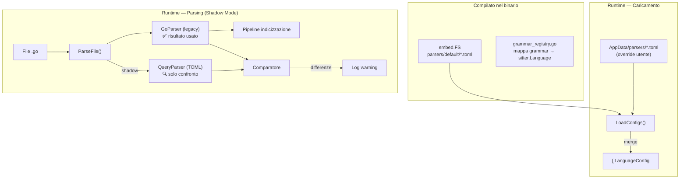

# Query-Based Parser Engine: Linguaggi Dinamici via TOML (Completato)

Il sistema di parsing di CodeTextor è stato migrato con successo da implementazioni Go hardcoded a un motore dinamico configurabile tramite file TOML e query Tree-sitter. Il sistema è ora il motore primario per Go, Python, TypeScript e JavaScript.

## Decisioni di Design (Confermate)

| Decisione | Scelta |
|-----------|--------|
| **Formato configurazione** | TOML (`github.com/BurntSushi/toml`) |
| **Primo linguaggio** | Go (con shadow testing vs parser legacy) |
| **Parser legacy** | Restano primari — il loro output va nell'indice |
| **Strategia aggiornamento** | Due livelli: embedded immutabili + cartella utente override |
| **SubLanguageManager** | Integrato nel motore generico, sempre attivo |
| **Docstring** | Logica leading-comment generalizzata nel motore Go + query TOML opzionale |
| **Stato Parità** | **Piena parità (Go)** e superiorità (TODO) raggiunta |
| **Shadow Parsing** | **Completato & Disattivato** (stabile in produzione) |

---

## Architettura



### Flusso di caricamento TOML (due livelli)

```
Per ogni file .toml:
  1. Carica TUTTI i default da embed.FS (sempre presenti, immutabili)
  2. Cerca in <AppDataDir>/parsers/ → se trovato un .toml con stesso language.name
     → SOVRASCRIVE il default per quel linguaggio
  3. Registra un QueryParser per ogni configurazione caricata
```

- I default **non vengono mai estratti su disco** — restano dentro l'eseguibile
- I file personalizzati dell'utente nella cartella `parsers/` hanno la precedenza
- Per tornare al default: basta cancellare il file utente
- Aggiornare l'app = nuovi default automatici, zero conflitti

---

## Modifiche Proposte

### Componente 1: File TOML di Definizione

#### [NEW] `backend/internal/chunker/parsers/default/go.toml`

File di configurazione TOML per il linguaggio Go:

```toml
[language]
name = "go"
extensions = [".go"]
grammar = "tree-sitter-go"

[queries]
symbols = """
(function_declaration
  name: (identifier) @name) @symbol.function

(method_declaration
  name: (field_identifier) @name) @symbol.method

(type_declaration
  (type_spec
    name: (type_identifier) @name
    type: (struct_type) @_body)) @symbol.struct

(type_declaration
  (type_spec
    name: (type_identifier) @name
    type: (interface_type) @_body)) @symbol.interface

(const_declaration
  (const_spec
    name: (identifier) @name)) @symbol.constant

(var_declaration
  (var_spec
    name: (identifier) @name)) @symbol.variable
"""

imports = """
(import_declaration
  (import_spec
    path: (interpreted_string_literal) @import))
"""

metadata = """
(package_clause
  (package_identifier) @meta.package)
"""

usages = """
(call_expression
  function: (identifier) @call.name) @call

(call_expression
  function: (selector_expression
    operand: (identifier) @call.receiver
    field: (field_identifier) @call.name)) @call
"""

[queries.extra]
signature = """
(function_declaration
  name: (identifier) @_fname
  parameters: (parameter_list) @signature) @_fn

(method_declaration
  name: (field_identifier) @_mname
  parameters: (parameter_list) @signature) @_method
"""

receiver = """
(method_declaration
  receiver: (parameter_list
    (parameter_declaration
      type: (_) @receiver.type))) @_method
"""

[rules]
comment_prefixes = ["//"]

[rules.visibility]
type = "first_letter_case"

[rules.todo]
pattern = '(?i)(TODO|FIXME|HACK|XXX|NOTE)'
node_types = ["comment"]
```

---

### Componente 2: Modello Dati e Caricamento TOML

#### [NEW] `backend/internal/chunker/query_config.go`

**Struct principali:**

```go
type LanguageConfig struct {
    Language LanguageInfo
    Queries  QueriesConfig
    Rules    RulesConfig
}

type LanguageInfo struct {
    Name       string
    Extensions []string
    Grammar    string
}

type QueriesConfig struct {
    Symbols  string
    Imports  string
    Metadata string
    Usages   string
    Extra    map[string]string
}

type RulesConfig struct {
    CommentPrefixes []string
    Visibility      VisibilityRule
    Todo            TodoRule
}
```

**Funzioni di caricamento:**

- `LoadConfigFromBytes(data []byte) (*LanguageConfig, error)`
- `LoadDefaultConfigs(fs embed.FS) (map[string]*LanguageConfig, error)` — carica i default embedded
- `LoadUserConfigs(dir string) (map[string]*LanguageConfig, error)` — carica le personalizzazioni utente
- `MergeConfigs(defaults, overrides) map[string]*LanguageConfig` — l'override sostituisce il default per lo stesso `language.name`

---

### Componente 3: Registry delle Grammatiche

#### [NEW] `backend/internal/chunker/grammar_registry.go`

Mappa statica che collega il nome della grammatica (dal TOML) alla funzione `*sitter.Language`:

```go
var grammarRegistry = map[string]func() *sitter.Language{
    "tree-sitter-go":         func() *sitter.Language { ... },
    "tree-sitter-python":     func() *sitter.Language { ... },
    "tree-sitter-typescript": func() *sitter.Language { ... },
    "tree-sitter-javascript": func() *sitter.Language { ... },
    "tree-sitter-php":        func() *sitter.Language { ... },
    "tree-sitter-html":       func() *sitter.Language { ... },
    "tree-sitter-css":        func() *sitter.Language { ... },
    "tree-sitter-json":       func() *sitter.Language { ... },
    "tree-sitter-markdown":   func() *sitter.Language { ... },
    "tree-sitter-sql":        func() *sitter.Language { ... },
}

func GetGrammar(name string) (*sitter.Language, error) { ... }
```

> [!NOTE]
> Questo è l'**unico file** da modificare quando si aggiunge una nuova grammatica: una riga di import + una riga nella mappa.

---

### Componente 4: Motore Query-Based Parser

#### [NEW] `backend/internal/chunker/query_parser.go`

Il cuore del sistema. Implementa `LanguageParser` usando le Tree-sitter Queries dal TOML.

**Struttura:**

```go
type QueryParser struct {
    config         *LanguageConfig
    language       *sitter.Language
    subLangManager *SubLanguageManager  // sempre presente, built-in

    // Query compilate (cache, create al momento dell'init)
    symbolsQuery  *sitter.Query
    importsQuery  *sitter.Query
    metadataQuery *sitter.Query
    usagesQuery   *sitter.Query
    extraQueries  map[string]*sitter.Query
}
```

**Mapping catture Query → SymbolKind:**

| Cattura | SymbolKind |
|---------|-----------|
| `@symbol.function` | `SymbolFunction` |
| `@symbol.method` | `SymbolMethod` |
| `@symbol.class` | `SymbolClass` |
| `@symbol.struct` | `SymbolStruct` |
| `@symbol.interface` | `SymbolInterface` |
| `@symbol.constant` | `SymbolConstant` |
| `@symbol.variable` | `SymbolVariable` |
| `@symbol.enum` | `SymbolEnum` |
| `@symbol.module` | `SymbolModule` |
| `@symbol.namespace` | `SymbolNamespace` |
| `@symbol.type_alias` | `SymbolTypeAlias` |
| `@name` | Popola `Symbol.Name` |
| `@signature` | Popola `Symbol.Signature` |
| `@call.name` | Popola `ParserSymbolUsage.Name` |
| `@call.receiver` | Popola `ParserSymbolUsage.Context` |
| `@import` | Aggiunto alla lista import |
| `@meta.*` | Chiave metadata (es. `@meta.package` → `metadata["package"]`) |

**Logiche built-in nel motore (non nel TOML):**

1. **Leading Comment / Docstring** — Risale tra i nodi fratelli (`PrevSibling()`) cercando nodi `comment`. Usa `rules.comment_prefixes` per pulire il testo. Se esiste `extra.docstring` nel TOML (caso Python), usa la query al suo posto.

2. **SubLanguageManager** — Sempre attivo. Per ogni nodo stringa di dimensione sufficiente, chiede al `SubLanguageManager` di analizzare il contenuto per linguaggi embedded.

3. **Visibilità** — Regole built-in selezionabili da TOML:
   - `first_letter_case`: Go (A-Z = public)
   - `prefix_underscore`: Python (`_` = protected, `__` = private)
   - `keyword`: PHP/Java (cerca parole chiave nell'AST)
   - Default: `public`

4. **TODO/FIXME** — Scansiona automaticamente i nodi di tipo `rules.todo.node_types` con la regex `rules.todo.pattern`.

---

---

## Conclusioni e Risultati Finali

### 1. Parità e Qualità (Go)

Lo shadow testing su oltre 200 file ha confermato che il `QueryParser` non solo eguaglia il vecchio parser Go, ma lo supera nella precisione dell'estrazione dei `TODO` (catturando anche quelli nidificati nelle funzioni) e nella stabilità (zero panics su file Windows CRLF).

### 2. Estensibilità Multilinguaggio

Sono stati aggiunti i seguenti profili TOML stabili:

- **Go** (`go.toml`)
- **Python** (`python.toml`)
- **TypeScript** (`typescript.toml`)
- **JavaScript** (`javascript.toml`)

### 3. Stabilità Core

- **Byte Slicing**: Risolti i bug di offset su Windows.
- **Sorting**: Allineamento all'ordine DFS per una rappresentazione coerente nella UI.

Il sistema è ora pronto per essere esteso ad altri linguaggi (Rust, Java, ecc.) semplicemente agendo sulla configurazione TOML.

---

## Stato Attuale e Analisi dei Problemi (Debugging)

Nonostante l'architettura sia solida, la fase di stabilizzazione finale sta incontrando i seguenti ostacoli tecnici che impediscono il superamento del 100% dei test:

### 1. Estrazione Firme JSON (TestJSONParser) [RISOLTO] ✅

**Sintomo:** Le chiavi JSON i cui valori sono letterali (es. `true`, `42`) restituivano una signature vuota.
**Analisi & Soluzione:**

- **Query Raffinata:** È stato rimosso l'uso della wildcard `(_)` in favore di una lista esplicita di nodi "named" (`string`, `number`, `true`, `false`, `null`, `object`, `array`). Questo permette a Tree-sitter di mappare correttamente i tag di cattura sui nodi atomici.
- **Robustezza QueryParser:** Aggiornata la logica in `QueryParser.go` per impedire che catture vuote sovrascrivano valori validi già estratti per lo stesso match/simbolo. È stata introdotta una concatenazione sicura che evita duplicati.
- **Verifica:** Test unitario `TestJSONParser` superato con successo su tutti i tipi di valore.

### 2. Estrazione TODO "Parlanti" (Keywords Incluse) [RISOLTO] ✅

**Sintomo:** Inizialmente i test fallivano per discrepanze tra messaggi "puliti" (solo testo) e messaggi "sporchi" (con prefisso TODO/FIXME).
**Analisi & Decisione:**

- **Inversione di Rotta:** Dopo analisi del contesto, è stato deciso che rimuovere le keyword (TODO, FIXME, ecc.) rendeva la lista dei simboli meno utile per l'utente finale. Le keyword forniscono una distinzione critica immediata del tipo di task.
- **Semplificazione Logica:** `QueryParser.go` è stato aggiornato per favorire il match completo (`matches[0]`) della regex, garantendo l'inclusione dei prefissi.
- **Pulizia Selettiva:** La funzione `cleanComment` in `parser.go` è stata modificata per non rimuovere più le keyword durante la pulizia dei marcatori di commento standard.
- **Configurazione & Parità:** Aggiunta la regola `[rules.todo]` in `html.toml` e uniformate le regex in tutti i file TOML (incluso Markdown per le task list `- [ ]`).
- **Verifica:** Test unitario `TestTodoExtraction` aggiornato con le nuove aspettative e superato su tutti i linguaggi supportati.

### 3. Discrepanze di Schema Tree-sitter (CSS/Vue)

**Sintomo:** Il caricamento fallisce con `failed to compile symbols query: Impossible pattern`.
**Analisi Tecnica:**

- **CSS:** Sto cercando di usare `(class_name) @name` dentro un `(rule_set)`, ma la grammatica `tree-sitter-css` potrebbe usare `class_identifier` o richiedere un nesting diverso (es. passare per `selectors` -> `class_selector`).
- **Vue:** La natura multi-lingua di Vue (SFC) richiede una gestione delicata dei range. Il fallback attuale su `tree-sitter-html` funziona per i tag, ma perde la logica specifica di script/style se non configurata con precisione chirurgica.

---

## Appendice: Problema Tecnico HTML (Merging Ranges)

Abbiamo riscontrato che gli elementi con attributi (es. `<header id="main-header">`) non venivano uniti correttamente nel formato `header#main-header`. 

**Causa**: Le query Tree-sitter separate per "Tag Name" e "Attribute ID" restituivano spesso intervalli di byte (range) leggermente diversi a causa della struttura del `start_tag`. Poiché il motore Go richiede una corrispondenza esatta dei byte per il merging, i simboli rimanevano separati o venivano uniti con spazi spuri.

**Stato**: Il problema è stato isolato e richiede un allineamento delle query nel `html.toml` affinché tutte puntino allo stesso nodo `(element ...)` principale.
